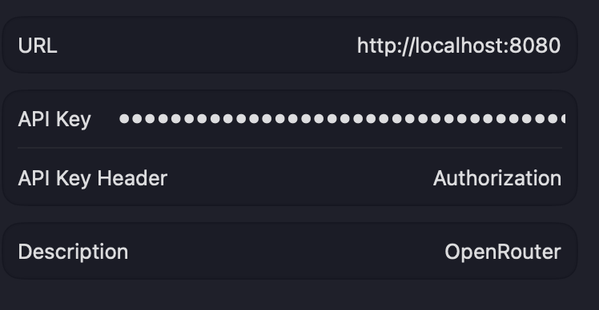

# OpenRouter Proxy for Xcode 26 Beta

This project creates a proxy for OpenRouter that modifies API responses to work with Xcode 26 beta as a model provider. The proxy transforms OpenRouter responses to match OpenAI's format, which is required by Xcode's native AI integration.

## Features
- `/models` endpoint returns models in OpenAI format
- `/chat/completions` endpoint proxies requests directly to OpenRouter
- Containerized with Docker
- Standalone pre-compiled executable

## Setup

### Docker Deployment
#### Option 1: Docker Compose (Recommended)
1. Create docker-compose.yml (already created in project)
2. Start the service:
```bash
docker-compose up
```

To use a different host port (e.g., 9090):
```bash
HOST_PORT=9090 docker-compose up
```

#### Option 2: Manual Docker Commands
1. Build the Docker image:
```bash
docker build -t openrouter-proxy ./proxy
```

2. Run the container:
```bash
docker run --rm -p ${HOST_PORT:-8080}:8080 openrouter-proxy
```

## Using with Proxyman (Debugging Proxy)

When using a debugging proxy like Proxyman, you might encounter SSL certificate verification errors. To resolve this:

1. Set the `DISABLE_SSL_VERIFY` environment variable to `true`:
```bash
# For Docker Compose
DISABLE_SSL_VERIFY=true docker-compose up

# For standalone executable
DISABLE_SSL_VERIFY=true ./proxy/dist/app
```

2. Trust Proxyman's root certificate in your system keychain (macOS):
   - Open Proxyman
   - Go to Certificate → Install Certificate on This Mac...
   - Follow prompts to add to System keychain
   - Open Keychain Access, find "Proxyman" certificate
   - Double-click it, expand Trust, and set "When using this certificate" to "Always Trust"

**Important Security Note:** Disabling SSL verification should only be done for debugging purposes. Never use this in production environments as it makes connections vulnerable to man-in-the-middle attacks.

### Standalone Executable Deployment
1. Make the build script executable:
```bash
chmod +x build_executable.sh
```

2. Build the standalone executable:
```bash
./build_executable.sh
```

3. Run the executable (default port 8080):
```bash
./proxy/dist/app
```

To run on a different port (e.g., 9090):
```bash
PORT=9090 ./proxy/dist/app
```

## Xcode Setup
- Setting > Intelligence > Add a Model Provider...
    - URL: http://localhost:8080
    - API Key: Bearer sk-...
    - API Key Header: Authorization
    - Description: OpenRouter

    

## Usage
- Get models in OpenAI format: `GET http://localhost:8080/models` (include your OpenRouter API key in the Authorization header)
- Use chat completions: `POST http://localhost:8080/chat/completions` with your request payload and Authorization header
